*(For a thorough overview of the Transformer model structure see [The Illustrated Transformer](https://jalammar.github.io/illustrated-transformer/) by Jay Alammar )*

The Transformer architecture, first proposed in [Attention is All you Need](https://arxiv.org/abs/1706.03762) as a valid alternative to sequential approaches for language modelling like [LSTMs](https://www.researchgate.net/publication/13853244_Long_Short-term_Memory), has become ubiquitous in the field of Natural Language Processing, pushing the state-of-the-art in most downstream language-related tasks.

This year's edition of the [International Conference on Learning Representation (ICLR)](https://iclr.cc/) brought a lot of promising revisions to the original Transformer and its more recent variants [BERT](https://www.aclweb.org/anthology/N19-1423/) and [Transformer-XL](https://www.aclweb.org/anthology/P19-1285/). Most proposed improvements fall into one of these categories, which correspond to well-known weaknesses of Transformers:

- Optimizing the complexity of self-attention.
- Inject linguistically-motivated inductive biases in the model architecture.
- Make the model more parameter- and data-efficient.

This post wants to summarize and provide a high-level overview of those contributions, highlighting current trends in the development of better and faster models for Natural Language Processing.

---

## Index

- [Self-Attention Variants](#self-attention-variants)
    - [Long-Short Range Attention](#long-short-range-attention)
    - [Tree-Structured Attention](#tree-structured-attention)
    - [Hashed Attention](#hashed-attention)
    - [eXtra Hop Attention](#extra-hop-attention)
- [Training Objectives](#training-objectives)
    - [Discriminative Replacement Task](#discriminative-replacement-task)
    - [Subtree Masking](#subtree-masking)
    - [Word and Sentence Structural Tasks](#word-and-sentence-structural-tasks)
    - [Type-Constrained Entity Replacement](#type-constrained-entity-replacement)
- [Embeddings](#embeddings)
    - [Position-Aware Complex Word Embeddings](#position-aware-complex-word-embeddings)
    - [Hierarchical Embeddings](#hierarchical-embeddings)
    - [Factorized Embedding Parametrization](#factorized-embedding-parametrization)
- [Model Architecture](#model-architecture)
    - [Compressive Memory](#compressive-memory)
    - [Reversible Layers](#reversible-layers)
    - [Cross-Layer Parameter Sharing](#cross-layer-parameter-sharing)
    - [Adaptive Depth Estimation](#adaptive-depth-estimation)

---

# Self-Attention Variants

One of the main components in the standard Transformer layer is **scaled dot-product self-attention**, taking in input queries $Q$ of dimension $d_k$, keys $K$ of dimension $d_k$ and values $V$ of dimension $d_v$ obtained from the projection of an activation tensor $A$ and returning:

$$\tag{1} \text{Attention}(Q,K,V) = \text{softmax}\Big(\frac{QK^T}{\sqrt d_k}\Big)V$$

In the **multi-head self-attention** version, the attention function is applied in parallel to $h$ version of queries, keys and values projected with learned projections $W$, and outputs are finally concatenated and projected again to obtain final values:

$$\text{MultiHead}(Q,K,V) = \text{Concat}(\text{head}_1,\dots, \text{head}_h)W^O$$

$$\tag{2} \text{where } \text{head}_i = \text{Attention}(QW_i^Q,KW_i^K,VW_i^V)$$

This section presents some variations of self-attention that make it more efficient and effective for language applications.

### Long-Short Range Attention

*Introduced in*: [Lite Transformer with Long-Short Range Attention](https://iclr.cc/virtual_2020/poster_ByeMPlHKPH.html) by Wu, Liu et al.

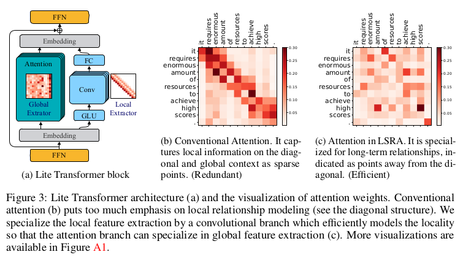

Conventional self-attention is deemed as redundant since it was empirically shown to put excessive emphasis on local relations inside a sentence, which can be modeled more efficiently by a standard convolution, as shown also in [On the Relationship between Self-Attention and Convolutional Layers](https://iclr.cc/virtual_2020/poster_HJlnC1rKPB.html). While the redundancy may help model performances in some cases, it is not suitable for lighter applications.

**Long-Short Range Attention (LSRA)** makes the computation more efficient by splitting the input in two parts along channel dimensions and feeding each to two modules: a **global extractor** using standard self-attention and a **local extractor** using light depth-wise convolutions. Authors report a $2\times$ reduced overall computation for the model, making it suitable for mobile settings.

### Tree-Structured Attention

*Introduced in*: [Tree-Structured Attention with Hierarchical Accumulation](https://iclr.cc/virtual_2020/poster_HJxK5pEYvr.html) by Nguyen et al.

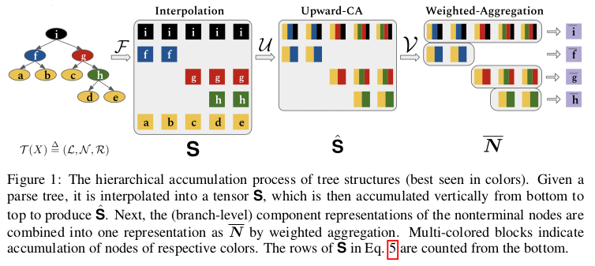

A weakness of the standard Transformer is the absence of inductive biases to account for the hierarchical structure of language. This is due in part to the difficulty in operating with tree-like structure, usually modeled by recurrent or recursive mechanisms, while maintaining the constant parallel time complexity of self-attention.

The proposed solution leverages consituency parses of input text to build a tree of hidden states, using **hierarchical accumulation** to build the value of non-terminals as the aggregation of lower representations in the tree. The final output representation is build by performing a **weighted aggregation** of branch-level representations. The cost for this inductive bias is added computational and memory cost, which is then mitigated using [parameter sharing](#cross-layer-parameter-sharing)

### Hashed Attention

*Introduced in*: [Reformer: The Efficient Transformer](https://iclr.cc/virtual_2020/poster_rkgNKkHtvB.html) by Kitaev et al.

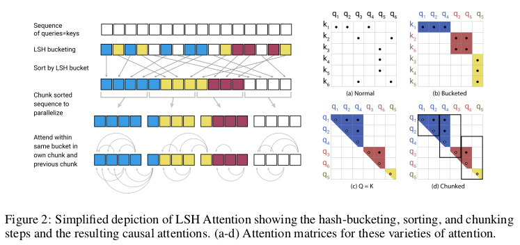

In the self-attention equation, the bottleneck is represented by the factor $QK^T$, which takes $\mathcal{O}(L^2)$ for input sequences of lenght $L$ both in computational and memory complexity. This effectively hinders the possibility of modeling long sequences.

**Reformer** proposes to restrict the pool of candidates attended by each query to a smaller set of neighbors found with **locally-sensitive hashing**. Since LSH is non-deterministic, similar vectors may sometimes fall in different neighborhoods. An approach using multiple parallel rounds of hashing is suggested to mitigate this issue. Using LSH attention reduces the computational cost of the self-attention operation to $\mathcal{O}(L \log L)$, allowing operations on longer sequences.

### eXtra Hop Attention

*Introduced in*: [Transformer-XH: Multi-Evidence Reasoning with eXtra Hop Attention](https://iclr.cc/virtual_2020/poster_r1eIiCNYwS.html) by Zhao et al.

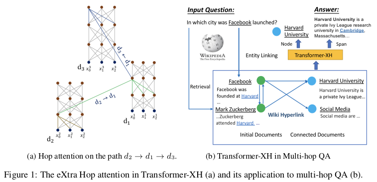

While Transformers have proven effective in modelling relations inside single sentences and pairs of sentences, they can hardly generalize to settings where evidence is scattered in multiple pieces of text, as for the task of **multi-hop question answering**.

**Transformer-XH** introduces a new variant of attention, **eXtra Hop Attention**, that can be applied to a graph of text sequences connected by edges (e.g. hyperlinks). This new attention mechanism uses the special \[CLS\] token at the beginning of each sequence as an "attention hub" that attends to all other connected sequences in the graph. The resulting representation is then combined to the one obtained by standard self-attention through a linear projection. The resulting model shows significant improvements for tasks requiring reasoning over graphs, at the cost of the extra computations introduced by the new attention mechanism.

# Training Objectives

While the original Transformer relied on the autoregressive language modeling objective for training, more recent bidirectional approaches like BERT take into account both past and future representations by using **masked language modelling (MLM)** on a small fraction of the input (usually ~15%). A sentence-level task like **next sentence prediction (NSP)** is usually added on top of that since many important language applications require an understanding of the relationship between two text sequences.

While those tasks seem to work quite well to induce meaningful token and sentence-level representation, many of the following approaches suggest better alternatives that make learning more efficient and grounded in the nature and the content of the input.

### Discriminative Replacement Task

*Introduced in*: [ELECTRA: Pre-training Text Encoders as Discriminators Rather Than Generators](https://iclr.cc/virtual_2020/poster_r1xMH1BtvB.html) by Clark et al.

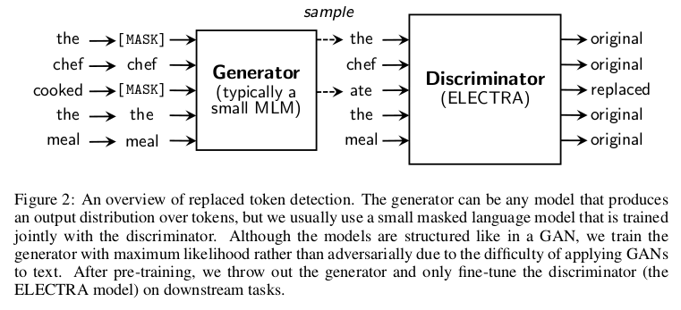

The masking strategy used in BERT-like models is very data inefficient, using only 15% of the input text to complete the MLM task. However, the percentage of masked data can hardly be augmented since having too many masked tokens degrade context information needed to complete the task.

**ELECTRA** propose a simple yet effective approach to cope with this inefficiency. A small masked language model is trained and then used as a generator to fill the masked tokens in the input with its predictions, as in normal MLM. However, the new task for the main model will be a **discriminative** one: instead of predicting masked tokens, the model detects which tokens have been replaced by the generator. This allows to leverage the entire input sequence for training. As mentioned by the authors, this approach consistently outperforms MLM pre-training given the same compute budget.

### Subtree Masking

*Introduced in*: [Tree-Structured Attention with Hierarchical Accumulation](https://iclr.cc/virtual_2020/poster_HJxK5pEYvr.html) by Nguyen et al.

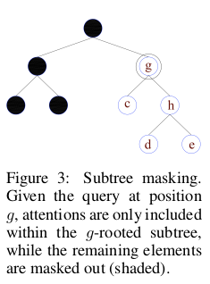

### Word and Sentence Structural Tasks

*Introduced in*: [StructBERT: Incorporating Language Structures into Pre-training for Deep Language Understanding](https://iclr.cc/virtual_2020/poster_BJgQ4lSFPH.html) by Wang et al.

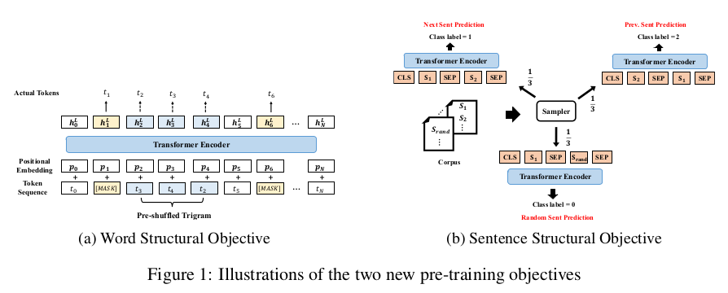

### Type-Constrained Entity Replacement

*Introduced in*: [Pretrained Encyclopedia: Weakly Supervised Knowledge-Pretrained Language Model](https://iclr.cc/virtual_2020/poster_BJlzm64tDH.html) by Xiong et al.

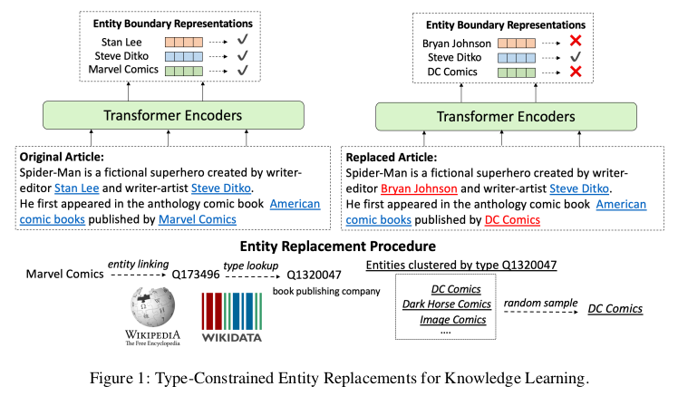

# Embeddings

### Position-Aware Complex Word Embeddings

*Introduced in*: [Encoding word order in complex embeddings](https://iclr.cc/virtual_2020/poster_Hke-WTVtwr.html) by Wang et al.

### Hierarchical Embeddings

*Introduced in*: [Tree-Structured Attention with Hierarchical Accumulation](https://iclr.cc/virtual_2020/poster_HJxK5pEYvr.html) by Nguyen et al.

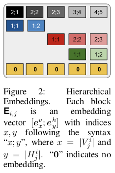

### Factorized Embedding Parametrization

*Introduced in*: [ALBERT: A Lite BERT for Self-supervised Learning of Language Representations](https://iclr.cc/virtual_2020/poster_H1eA7AEtvS.html) by Lan et al.

# Model Architecture

### Compressive Memory

*Introduced in*: [Compressive Transformers for Long-Range Sequence Modelling](https://iclr.cc/virtual_2020/poster_SylKikSYDH.html) by Rae et al.

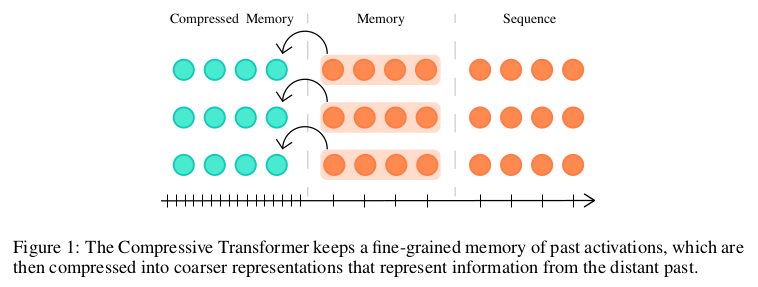

### Reversible Layers

*Introduced in*: [Reformer: The Efficient Transformer](https://iclr.cc/virtual_2020/poster_rkgNKkHtvB.html) by Kitaev et al.

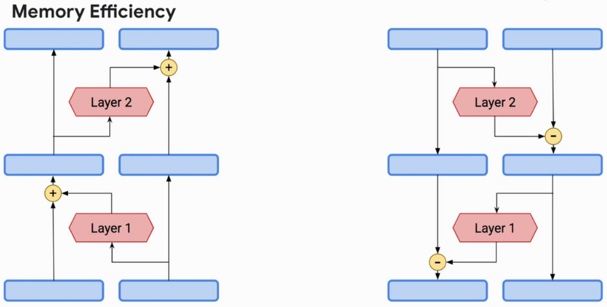

### Cross-Layer Parameter Sharing

*Introduced in*: [ALBERT: A Lite BERT for Self-supervised Learning of Language Representations](https://iclr.cc/virtual_2020/poster_H1eA7AEtvS.html) by Lan et al.

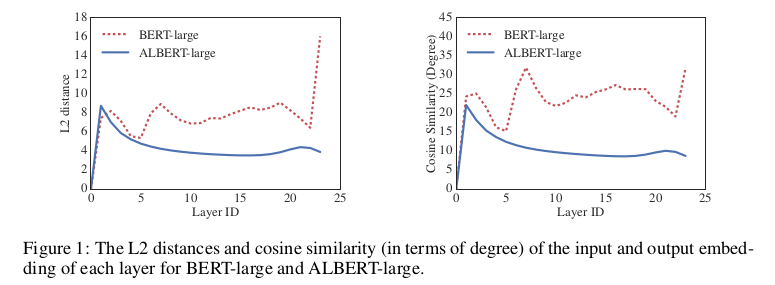

Also untie hidden layer and word embeddings by projecting embeddings to hidden layer dimension to reduce size in memory.

### Adaptive Depth Estimation

*Introduced in*: [Depth-Adaptive Transformer](https://iclr.cc/virtual_2020/poster_SJg7KhVKPH.html) by Elbayad et al.

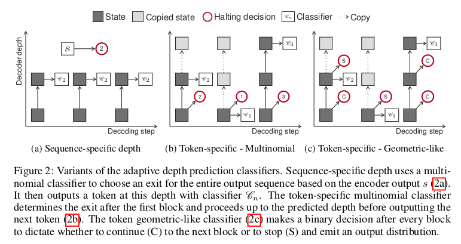

*See also:* [What’s new for Transformers at the ICLR 2020 Conference?](https://towardsdatascience.com/whats-new-for-transformers-at-the-iclr-2020-conference-4285a4294792) by Sergi Castella