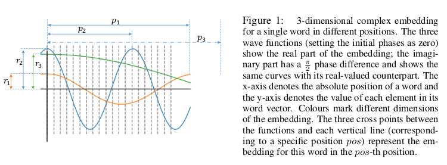

*(For an overview of the Transformer, see [The Illustrated Transformer](https://jalammar.github.io/illustrated-transformer/) by Jay Alammar )*

The Transformer architecture was first proposed in [Attention is All you Need](https://arxiv.org/abs/1706.03762) as a valid alternative to sequential language modeling approaches like [LSTMs](https://www.researchgate.net/publication/13853244_Long_Short-term_Memory) and has since then become ubiquitous in the field of Natural Language Processing, pushing the state-of-the-art in most downstream language-related tasks.

This year's edition of the [International Conference on Learning Representation (ICLR)](https://iclr.cc/) brought a lot of promising revisions to the original Transformer and its more recent variants [BERT](https://www.aclweb.org/anthology/N19-1423/) and [Transformer-XL](https://www.aclweb.org/anthology/P19-1285/). Proposed improvements address the well-known weaknesses of Transformers, namely:

- Optimizing the self-attention computation.
- Injecting linguistically-motivated inductive biases in the model architecture.
- Making the model more parameter and data-efficient.

This post wants to summarize and provide a high-level overview of those contributions, highlighting current trends in the development of better and faster models for Natural Language Processing. All image credits go to their respective paper authors.

---

## Index

- [Self-Attention Variants](#self-attention-variants)
    - [Long-Short Range Attention](#long-short-range-attention)
    - [Tree-Structured Attention with Subtree Masking](#tree-structured-attention-with-subtree-masking)
    - [Hashed Attention](#hashed-attention)
    - [eXtra Hop Attention](#extra-hop-attention)
- [Training Objectives](#training-objectives)
    - [Discriminative Replacement Task](#discriminative-replacement-task)
    - [Word and Sentence Structural Tasks](#word-and-sentence-structural-tasks)
    - [Type-Constrained Entity Replacement](#type-constrained-entity-replacement)
- [Embeddings](#embeddings)
    - [Position-Aware Complex Word Embeddings](#position-aware-complex-word-embeddings)
    - [Hierarchical Embeddings](#hierarchical-embeddings)
    - [Factorized Embedding Parametrization](#factorized-embedding-parametrization)
- [Model Architecture](#model-architecture)
    - [Compressive Memory](#compressive-memory)
    - [Reversible Layers](#reversible-layers)
    - [Cross-Layer Parameter Sharing](#cross-layer-parameter-sharing)
    - [Adaptive Depth Estimation](#adaptive-depth-estimation)
- [Conclusion](#conclusion)

---

# Self-Attention Variants

**Scaled dot-product self-attention** is one of the main components in the standard Transformer layer, enabling the modelling of dependencies regardless of their distance in the input. The self-attention operation projects an input activation tensor $\bf A$ to queries $Q$ of dimension $d_k$, keys $K$ of dimension $d_k$ and values $V$ of dimension $d_v$, returning a weighted version of $V$:

$$\tag{1} \text{Attention}(Q,K,V) = \text{softmax}\Big(\frac{QK^T}{\sqrt d_k}\Big)V$$

In the **multi-head self-attention** variant, the attention function is applied in parallel to $h$ version of queries, keys and values projected with learned projections $W$, and outputs are finally concatenated and projected again to obtain final values:

$$\text{MultiHead}(Q,K,V) = \text{Concat}(\text{head}_1,\dots, \text{head}_h)W^O$$

$$\tag{2} \text{where } \text{head}_i = \text{Attention}(QW_i^Q,KW_i^K,VW_i^V)$$

This section presents some variants of the self-attention component that make it more efficient and effective in the context of language applications.

### Long-Short Range Attention

*Introduced in*: [Lite Transformer with Long-Short Range Attention](https://iclr.cc/virtual_2020/poster_ByeMPlHKPH.html) by Wu, Liu et al.

Conventional self-attention is deemed as redundant since it was empirically shown to put excessive emphasis on local relations inside a sentence, which can be modeled more efficiently by a standard convolution, as shown also in [On the Relationship between Self-Attention and Convolutional Layers](https://iclr.cc/virtual_2020/poster_HJlnC1rKPB.html). While the redundancy may help model performances in some cases, it is not suitable for lighter applications.

**Long-Short Range Attention (LSRA)** makes the computation more efficient by splitting the input into two parts along channel dimensions and feeding each to two modules: a **global extractor** using standard self-attention and a **local extractor** using light depth-wise convolutions. Authors report a $2\times$ reduced overall computation for the model, making it suitable for mobile settings.

### Tree-Structured Attention with Subtree Masking

*Introduced in*: [Tree-Structured Attention with Hierarchical Accumulation](https://iclr.cc/virtual_2020/poster_HJxK5pEYvr.html) by Nguyen et al.

A weakness of the standard Transformer is the absence of inductive biases to account for the hierarchical structure of language. This is due in part to the difficulty in operating with tree-like structures that are usually modeled by recurrent or recursive mechanisms while maintaining the constant parallel time complexity of self-attention.

The proposed solution leverages constituency parses of input text to build a tree of hidden states, using **hierarchical accumulation** to build the value of non-terminals as the aggregation of lower representations in the tree. The final output representation is built by performing a **weighted aggregation** of branch-level representations.

An interesting addition is the use of **subtree masking** to filter out superfluous noise by constraining the attention of each node query only on its subtree descendants. The cost for this inductive bias is an increased computational and memory cost, which is then mitigated using [parameter sharing](#cross-layer-parameter-sharing)

### Hashed Attention

*Introduced in*: [Reformer: The Efficient Transformer](https://iclr.cc/virtual_2020/poster_rkgNKkHtvB.html) by Kitaev et al.

In the self-attention equation the factor $QK^T$ represents a bottleneck, taking $\mathcal{O}(L^2)$ for input sequences of length $L$ both in computational and memory complexity. This effectively hinders the possibility of modeling long sequences.

**Reformer** proposes to restrict the pool of candidates attended by each query to a small set of neighbors found through **locally-sensitive hashing**. Since LSH bucketing employs random projections, similar vectors may sometimes fall in different neighborhoods; an approach using multiple parallel rounds of hashing is suggested to mitigate this issue. Using LSH attention reduces the computational cost of the self-attention operation to $\mathcal{O}(L \log L)$, allowing the model to operate on longer sequences.

### eXtra Hop Attention

*Introduced in*: [Transformer-XH: Multi-Evidence Reasoning with eXtra Hop Attention](https://iclr.cc/virtual_2020/poster_r1eIiCNYwS.html) by Zhao et al.

While Transformers were optimized to operate on single sequences or pairs of sequences, they can hardly generalize to settings where evidence is scattered in multiple pieces of text, as for the challenging task of **multi-hop question answering**.

**Transformer-XH** introduces a new variant of attention, **eXtra Hop Attention**, that can be applied to a graph of text sequences connected by edges (e.g. hyperlinks). This new attention mechanism uses the special `[CLS]` token at the beginning of each sequence as an **attention hub** that attends to all other connected sequences in the graph. The resulting representation is then combined to the one obtained by standard self-attention through a linear projection. The resulting model shows significant improvements for tasks requiring reasoning over graphs, at the cost of the extra computations introduced by the new attention mechanism.

# Training Objectives

The pre-training of Transformer models is usually achieved by the mean of multiple unsupervised objectives, leverage huge quantities of non-annotated texts. The most common tasks used for this purpose are **autoregressive language modeling**, also known as standard language modeling (LM), and **autoencoding of masked input**, often referred to as **masked language modeling (MLM)**.

The standard Transformer implementation and its [GPT variants](https://openai.com/blog/better-language-models/) adopt the autoregressive approach, leveraging a unidirectional context (forward or backward) inside a sequence $\textbf{x} = (x_1, \dots, x_L)$ to estimate next token probability:

$$p(\textbf{x}) = \prod_{l=1}^L p(x_l|\textbf{x}_{< or >l})$$

Instead, BERT-like approaches use a bidirectional context to recover a small fraction of the input that was artificially replaced by special `[MASK]` tokens. This variant was shown to be especially effective for downstream natural language understanding tasks.

Besides word-level modeling, a sentence-level classification task like **next sentence prediction (NSP)** is usually added to the training procedure since many important language applications require an understanding of the relationship between two sequences.

While those tasks seem to induce meaningful token and sentence-level representation, many of the approaches covered in this section suggest better alternatives that make learning more efficient and grounded in the structure and the content of the input.

### Discriminative Replacement Task

*Introduced in*: [ELECTRA: Pre-training Text Encoders as Discriminators Rather Than Generators](https://iclr.cc/virtual_2020/poster_r1xMH1BtvB.html) by Clark et al.

The masking strategy used in BERT-like models is very data inefficient, using only ~15% of the input text to complete the MLM task. However, the percentage of masked data can hardly be increased since having too many masked tokens may degrade the overall context information.

**ELECTRA** proposes a simple yet effective approach to cope with this inefficiency. A small masked language model is trained and then used as a generator to fill the masked tokens in the input with its predictions, as in normal MLM. However, the new task for the main model will be a **discriminative** one: instead of predicting masked tokens, the model has to detect which tokens have been replaced by the generator. This allows leveraging the entire input sequence for training. As mentioned by the authors, this approach consistently outperforms MLM pre-training given the same compute budget.

### Word and Sentence Structural Tasks

*Introduced in*: [StructBERT: Incorporating Language Structures into Pre-training for Deep Language Understanding](https://iclr.cc/virtual_2020/poster_BJgQ4lSFPH.html) by Wang et al.

As we saw previously, Transformers do not explicitly account for structures present in the input. While tree-structured attention injects a heavy hierarchical bias in the model architecture, **StructBERT** adopts two lighter but effective approaches to make the resulting representations more aware of the underlying sequentiality of language.

The first is a **word structural objective** where trigrams inside the inputs are randomly shuffled, and their original position must be reconstructed. This is done in parallel with normal MLM. The **sentence structural objective** is a lighter variant of the sentence reordering introduced in [ERNIE 2.0](https://arxiv.org/abs/1907.12412) and equal to the **sentence ordering prediction** introduced in [ALBERT](https://iclr.cc/virtual_2020/poster_H1eA7AEtvS.html): given a pair of sentences $(S_1, S_2)$ as input, we ask the model to discriminate whether $S_2$ precedes, follows or is unrelated to $S_1$. This new task extends the standard NSP, which was deemed as too easy for learning meaningful sentence relations. These additions result in significant improvements over standard benchmarks for natural language understanding.

### Type-Constrained Entity Replacement

*Introduced in*: [Pretrained Encyclopedia: Weakly Supervised Knowledge-Pretrained Language Model](https://iclr.cc/virtual_2020/poster_BJlzm64tDH.html) by Xiong et al.

While it was shown that pre-trained Transformer models implicitly capture real-world knowledge, their standard training objectives do not explicitly take into account the entity-centric information needed for robust reasoning over real-world settings.

**Type-constrained entity replacement** is a weakly supervised approach where random entities in the text are replaced with other entities taken from Wikidata that have the same entity type. The model then uses a discriminative objective similar to the one of [ELECTRA](#discriminative-replacement-task) to determine which entities were replaced. This is done along with MLM in a multi-task setup, and authors report significant improvements in settings requiring a deeper entity understanding, such as **open-domain QA** and **entity typing**.

# Embeddings

The original Transformer relies on two sets of embeddings to represent the input sequence:

- Learned **word embeddings** for each token present in the vocabulary, used as token vector representations for the model.

- Fixed **positional embeddings (PE)**, used to inject information about the position of tokens in the sequence. For position $\text{pos}$ and dimension $i$, those correspond to sinusoidal periodic functions that were empirically shown to perform on par with learned embeddings, and were chosen to enable extrapolation for longer sequences:

$$PE_{pos, 2i} = \sin(\text{pos}/10000^{2i/d_{model}})$$

$$PE_{pos, 2i + 1} = \cos(\text{pos}/10000^{2i/d_{model}})$$

For BERT-like models able to operate on multiple input segments, a third set of learned **segment embeddings** is used to differentiate tokens belonging to different sentences. 

All those embeddings have the same dimensions and get summed together to obtain an input representation. Approaches introduced in this section aim to inject more structure in the embeddings, or to optimize their dimension for better efficiency.

### Position-Aware Complex Word Embeddings

*Introduced in*: [Encoding word order in complex embeddings](https://iclr.cc/virtual_2020/poster_Hke-WTVtwr.html) by Wang et al.

While PE capture different positions in the input, they do not explicitly take into account the relation between those positions, i.e. ordered relationships such as adjacency or precedence. This problem was already addressed in [Transformer-XL](https://www.aclweb.org/anthology/P19-1285/) by leveraging relative distances between words instead of raw position indices.

A proposed improvement is to generalize word embeddings to continuous functions defined over positions, extending the solutions to the complex-valued domain to benefit from richer representations. The resulting **complex-valued embeddings** introduce new parameters for amplitudes, frequencies and initial phases that determine various properties of the embedding such as position sensitivity. Empirical results show that the complex embeddings with parameter-sharing schemas outperform previous embedding approaches without a significant increase in the number of trainable parameters.

### Hierarchical Embeddings

*Introduced in*: [Tree-Structured Attention with Hierarchical Accumulation](https://iclr.cc/virtual_2020/poster_HJxK5pEYvr.html) by Nguyen et al.

In the overview of [tree-structured attention](#tree-structured-attention-with-subtree-masking), we saw how hierarchical accumulation is used to form a representation based on descendants for nonterminal nodes. This procedure, however, has the disadvantage of not taking into account the hierarchical structure of descendants.

**Hierarchical embeddings** are used to inject this structural bias by concatenating **vertical** and **horizontal embeddings matrices** representing respectively hierarchical ordering inside branches and relationships between siblings nodes in a subtree. Those embeddings are shared across attention heads, thus accounting only for 0.1% of the total parameters.

### Factorized Embedding Parametrization

*Introduced in*: [ALBERT: A Lite BERT for Self-supervised Learning of Language Representations](https://iclr.cc/virtual_2020/poster_H1eA7AEtvS.html) by Lan et al.

In recent models based on BERT and Transformer-XL the input embeddings size $E$ is tied with the hidden layer size $H$, i.e. $E \equiv H$. This is very impractical since, to augment the expressivity of hidden representations used to learn *context-dependent representation*, one should also increase the size of the embedding matrix $\textbf{M} = V \times E$, where $V$ is the vocabulary size. Even for relatively small hidden layer dimensions, this results in billions of parameters that are rarely updated during training.

**ALBERT** authors propose to insert a projection between $E$ and $V$ to make both dimensions independent, an approach that is especially efficient to reduce the parameter count when $H \gg E$. As a result, an ALBERT base with $E = 128$ and $H = 768$ obtains performances comparable with a BERT base with the same configuration on many downstream tasks, using 21M fewer parameters (89M in Table 3 vs 110M for BERT).

# Model Architecture

The original Transformer architecture is composed of an encoder and a decoder, each composed by a stacked sequence of identical layers that transform input embeddings in outputs having the same dimension (hence the name Transformer).

Each layer of the Transformer encoder is composed of two sublayers, a multi-head self-attention mechanism and a feed-forward network, surrounded by residual connections and followed by layer normalization. The decoder adds a third layer that performs multi-head self-attention over the encoder output while modifying the original self-attention sublayer to prevent attending to future context, as required by the autoregressive language modeling objective saw before.

Bidirectional variants of the Transformer drop the decoder structure and focus solely on the encoder to generate the contextual embeddings needed for various tasks, including MLM.

[Transformer-XL](https://www.aclweb.org/anthology/P19-1285/) notably introduces a notion of **memory** for Transformer networks, where hidden states obtained in previous segments are weighted with attention and reused to better model long-term dependencies, preventing **context fragmentation**.

The following approaches try to build on top of current structures to improve long-range modeling, reduce the parameter count, or optimize the computation performed by the model. 

### Compressive Memory

*Introduced in*: [Compressive Transformers for Long-Range Sequence Modelling](https://iclr.cc/virtual_2020/poster_SylKikSYDH.html) by Rae et al.

In Transformer-XL's recurrent memory approach, old memories are discarded to enable the storing of new ones in a first-in-first-out fashion. This method accounts only for recency, not taking into account the relevance of information that might get discarded.

**Compressive Transformers** builds upon the memory notion by adding a new **compressed memory** that stores coarse representations of older memories instead of discarding them. Authors try multiple alternatives for the compression function, finally selecting an **attention-reconstruction loss** that discards information that is not attended by the network. The use of compressive memory shows large improvements over the modeling of infrequent words, with empirical evidence of the network learning to preserve salient information through the compression mechanism.

### Reversible Layers

*Introduced in*: [Reformer: The Efficient Transformer](https://iclr.cc/virtual_2020/poster_rkgNKkHtvB.html) by Kitaev et al.

The main idea behind **reversibility** is to enable the recovering of activations in any layer of the network by using only activations of the following layer and model parameters. This feature is especially interesting when applied to Transformer models since they are usually composed of a large pile of stacked layers and their memory complexity grows linearly with the layer count.

**Reformer** introduces reversibility in the Transformer architecture by combining attention and feed-forward sublayers into a single reversible layer. This allows to store activations only for the topmost layer and recover all the other ones by reversing layers during back-propagation, making the model depth irrelevant from a memory perspective. Further improvements in memory complexity are achieved by **chunking** independent computations in feed-forward and reversible layers. 

### Cross-Layer Parameter Sharing

*Introduced in*: [ALBERT: A Lite BERT for Self-supervised Learning of Language Representations](https://iclr.cc/virtual_2020/poster_H1eA7AEtvS.html) by Lan et al.

A simple yet very effective approach to greatly reduce the parameter count inside deep Transformer models is to share parameters across multiple layers, as it was shown in the [Universal Transformer](https://arxiv.org/abs/1807.03819) paper at ICLR 2019.

**ALBERT** authors experiment cross-layer parameter sharing for both self-attention and feed-forward sublayers, finding that sharing both weight matrices contributes to bringing down the total parameter count of the model by a factor of $7\times$ (for embedding size $E = 128$) while only slightly affecting final performances. The use of parameter sharing leads to smoother transition across layers and effectively stabilizes network parameters. 

### Adaptive Depth Estimation

*Introduced in*: [Depth-Adaptive Transformer](https://iclr.cc/virtual_2020/poster_SJg7KhVKPH.html) by Elbayad et al.

Current models perform a fixed number of computations for each input, regardless of the underlying complexity specific to each sequence. This problem was already highlighted in the [Universal Transformer](https://arxiv.org/abs/1807.03819), which proposes a repeated application of the same layer with **adaptive computation time (ACT)**, but the resulting increase in per-layer weights considerably reduce the overall network speed.

**Depth-adaptive Transformer** solves this issue by encoding a sequence with a standard Transformer encoder and decoding it with a variable number of steps. To do so, a classifier is attached to each repeated layer of the decoder and the whole set is then trained with **aligned** and **mixed training** (see image) using the **anytime prediction** approach first introduced in the field of computer vision. Authors explore different mechanisms to adaptively control the amount of computation both on sequence level and on a per-token basis and conclude that an adaptive reduction of more than 75% of decoder layers can be applied without any loss in accuracy on machine translation tasks.

# Conclusion

As you can see from the sections above, many of these approaches offer widely applicable solutions to specific problems that characterize the original Transformer architecture, ranging from the self-attention computation to the model structure itself. 

Many of these approaches seem promising for future developments of the Transformer and, most importantly, are likely to bring complementary improvements once many of them included in a single architecture. 

In light of this, my wish for ICLR 2021 is to see more incremental work that puts together already-existing strategies to highlight the most effective combinations between them.

*See also:* [What’s new for Transformers at the ICLR 2020 Conference?](https://towardsdatascience.com/whats-new-for-transformers-at-the-iclr-2020-conference-4285a4294792) by Sergi Castella